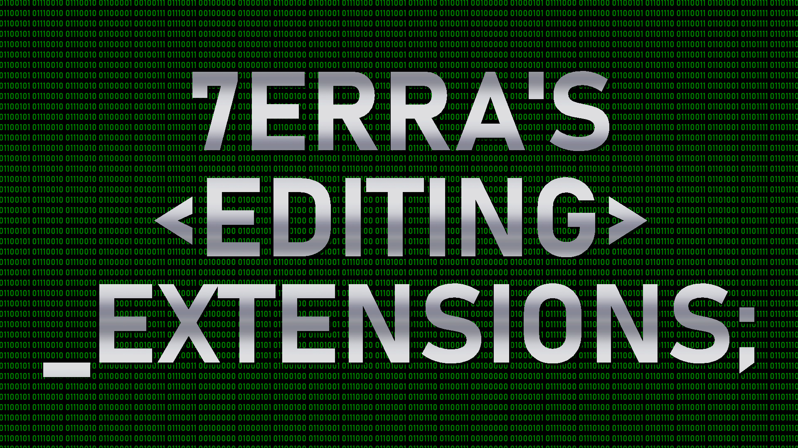

# Terra's Editing Extensions

This is the Github repository for the Arma 3 mod "Terra's Editing Extensions". The mod adds some features that intend to make content creation easier.

## Download
The stable build can be downloaded from the Steam Workshop page. The same version can also be found on the master branch of this repository. For WIP version check out the other branches.

## Links
* [Steam Workshop page](https://steamcommunity.com/sharedfiles/filedetails/?id=1387934106)  
* [Bohemia Interactive Forums thread](https://forums.bohemia.net/forums/topic/217263-7erras-editing-extensions/)

## License
  
This work is licensed under the GNU General Public License v3.0. See the [LICENSE.md](LICENSE.md).